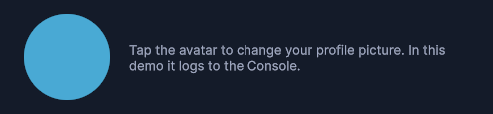

---------

## Contents

> 1 [Overview](#overview)
>
> 2 [Properties](#properties)
>
> 3 [USS Classes](#uss-classes)
>
> 4 [Events](#events)
>
> 5 [Methods](#methods)
>
> 6 [Usage](#usage)
>
> 7 [Using the Control](#using-the-control)
>
> 8 [Example Scenes](#example-scenes)
>
> 9 [Credits and Donation](#credits-and-donation)
>
> 10 [External links](#external-links)

---------

## Overview

`CircularImageButton` is a circular button that displays an image or sprite at full bleed with a 50% border-radius. When no image is set it shows a centered overlay (typically an upload icon and label) to prompt the user to select a photo.

Typical use cases:

- Avatar display and photo selection in profile screens
- Circular media thumbnails in lists or grids
- Any tap target that must hold a user-supplied image

---------

## Properties

This control has no data properties. Configure it through method calls and respond to the `Clicked` event.

---------

## USS Classes

| Class | Description |
| --- | --- |
| `circularImageButton` | Root element. Applies circular clip via `border-radius: 50%`. |
| `circularImageButton__image` | The image layer. Absolutely positioned, fills the button, `border-radius: 50%`. |
| `circularImageButton__noImageOverlay` | Overlay shown when no image is set. Absolutely positioned and centered. |
| `circularImageButton__icon` | Icon inside the no-image overlay (typically an upload/camera glyph). |
| `circularImageButton__uploadLabel` | Text label inside the no-image overlay. |
| `circularImageButton--hasImage` | Modifier applied to the root when an image is present. Hides the no-image overlay. |

---------

## Events

| Name | Description | Arguments |
| --- | --- | --- |
| `Clicked` | Fired when the button receives a pointer-up event inside its bounds. | none |

---------

## Methods

| Signature | Description |
| --- | --- |
| `SetImage(Texture2D texture, bool isDefault = false)` | Sets the displayed image from a `Texture2D`. Pass `isDefault = true` to treat the image as a placeholder (does not apply the `--hasImage` modifier). |
| `SetImage(Sprite sprite, bool isDefault = false)` | Sets the displayed image from a `Sprite`. Same `isDefault` semantics. |
| `SetUploadLabel(string text)` | Updates the text shown inside the no-image overlay. |
| `ClearImage()` | Removes the current image and restores the no-image overlay. |
| `SetImageTint(Color color)` | Applies a tint color to the image element. |

---------

## Usage

> Add the control to your scene using:
>
> GameObject -> UI Toolkit -> Extensions -> Circular Image Button
>
> This creates a UIDocument in the scene (plus a PanelSettings with the default runtime theme, if the project has none) and assigns an editable starter template with demo content, copied to *Assets/UI Toolkit Extensions*.
>
> A starter template can also be added to an existing document using:
>
> Assets -> Create -> UI Toolkit -> Extensions -> Circular Image Button Starter

Alternatively, drag the control into a document from the UI Builder Library (*Project -> Custom Controls -> UnityUIToolkit.Extensions*) or declare it directly in UXML:

```xml
<ui:UXML xmlns:ui="UnityEngine.UIElements" xmlns:ext="UnityUIToolkit.Extensions" editor-extension-mode="False">
    <ext:CircularImageButton upload-label="Upload Image" />
</ui:UXML>
```

The shared extensions stylesheet is applied automatically when the control is created in the Editor and in Play Mode, so no manual stylesheet reference is needed while authoring. The starter templates also reference the stylesheet explicitly, which covers player builds; for hand-written UXML or code-first UI in builds, add the stylesheet to your UXML or panel theme.

---------

## Using the Control

### Basic Setup

```csharp
using UnityEngine;
using UnityEngine.UIElements;
using UnityUIToolkit.Extensions;

public class AvatarController : MonoBehaviour
{
    [SerializeField] private UIDocument _document;
    [SerializeField] private Texture2D _defaultAvatar;

    private CircularImageButton _avatarButton;

    private void OnEnable()
    {
        var root = _document.rootVisualElement;
        _avatarButton = new CircularImageButton();

        // Show a default placeholder image without hiding the overlay
        _avatarButton.SetImage(_defaultAvatar, isDefault: true);
        _avatarButton.SetUploadLabel("Tap to change");

        _avatarButton.Clicked += OnAvatarTapped;
        root.Add(_avatarButton);
    }

    private void OnAvatarTapped()
    {
        // Open native photo picker, then call SetImage with the result
        Debug.Log("Avatar tapped — open photo picker");
    }

    private void ApplyPickedPhoto(Texture2D picked)
    {
        // isDefault: false — hides the overlay and marks the button as having an image
        _avatarButton.SetImage(picked, isDefault: false);
    }

    private void ResetAvatar()
    {
        _avatarButton.ClearImage();
    }
}
```

### Tint and Dynamic Color

```csharp
// Grey-out the avatar when the profile is locked
_avatarButton.SetImageTint(new Color(1f, 1f, 1f, 0.4f));

// Restore full color
_avatarButton.SetImageTint(Color.white);
```

---------

## Example Scenes

This control is demonstrated in the following package examples:

- [Profile Editor](/uitoolkit/examples/profile-editor/)
- [Image Crop Overlay](/uitoolkit/examples/image-crop-overlay/)

---------

## Credits and Donation

SimonDarksideJ

---------

## External links

[UI Toolkit Extensions repository](https://github.com/Unity-UI-Extensions/com.unity.uitoolkitextensions) | [OpenUPM package](https://openupm.com/packages/com.unity.uitoolkitextensions/)

---------
