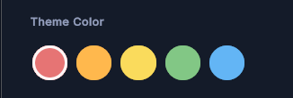

---------

## Contents

> 1 [Overview](#overview)
>
> 2 [Properties](#properties)
>
> 3 [USS Classes](#uss-classes)
>
> 4 [Events](#events)
>
> 5 [Methods](#methods)
>
> 6 [Usage](#usage)
>
> 7 [Using the Control](#using-the-control)
>
> 8 [Video Demo](#video-demo)
>
> 9 [Credits and Donation](#credits-and-donation)
>
> 10 [External links](#external-links)

---------

## Overview

`ColorToggleGroup` manages a set of `ColorToggleButton` items as a single-selection group. It supports both tap-to-select and drag-to-select gestures, ensuring that only one color is selected at a time. Selection state is coordinated internally; consumers only need to respond to `OnColorSelected`.

Typical use cases:

- Full-screen or inline color pickers
- Theme or accent color selectors
- Tag or category color selectors

---------

## Properties

| Name | Description | Options |
| --- | --- | --- |
| `Colors` | Gets or sets the array of colors represented by the group. Changing this value rebuilds all child buttons. | `Color[]` |
| `SelectedColor` | Gets the currently selected color. `null` if nothing is selected. | `Color?` (nullable) |
| `Alignment` | Controls the flex direction of the buttons container. | `FlexDirection` |

---------

## USS Classes

| Class | Description |
| --- | --- |
| `colorToggleGroup` | Root element. |
| `colorToggleGroup__container` | Flex container that holds all `ColorToggleButton` children. |

---------

## Events

| Name | Description | Arguments |
| --- | --- | --- |
| `OnColorSelected` | Fired when the user selects a color by tap or drag. Not fired when selection changes programmatically via `SelectColor(color, propagateEvent: false)`. | `Color selectedColor` |

---------

## Methods

| Signature | Description |
| --- | --- |
| `DeselectAll()` | Clears the current selection without firing `OnColorSelected`. |
| `SelectColor(Color color, bool propagateEvent = true)` | Programmatically selects the button whose color matches. Pass `propagateEvent: false` to suppress `OnColorSelected`. |

---------

## Usage

> Add the control to your scene using:
>
> GameObject -> UI Toolkit -> Extensions -> Color Toggle Group
>
> This creates a UIDocument in the scene (plus a PanelSettings with the default runtime theme, if the project has none) and assigns an editable starter template with demo content, copied to *Assets/UI Toolkit Extensions*.
>
> A starter template can also be added to an existing document using:
>
> Assets -> Create -> UI Toolkit -> Extensions -> Color Toggle Group Starter

Alternatively, drag the control into a document from the UI Builder Library (*Project -> Custom Controls -> UnityUIToolkit.Extensions*) or declare it directly in UXML:

```xml
<ui:UXML xmlns:ui="UnityEngine.UIElements" xmlns:ext="UnityUIToolkit.Extensions" editor-extension-mode="False">
    <ext:ColorToggleGroup alignment="Row" colors="#FF5A5A,#FFB13D,#4DD08C,#4D9FFF,#B36BFF" />
</ui:UXML>
```

The shared extensions stylesheet is applied automatically when the control is created in the Editor and in Play Mode, so no manual stylesheet reference is needed while authoring. The starter templates also reference the stylesheet explicitly, which covers player builds; for hand-written UXML or code-first UI in builds, add the stylesheet to your UXML or panel theme.

---------

## Using the Control

### Inline Color Picker

```csharp
using UnityEngine;
using UnityEngine.UIElements;
using UnityUIToolkit.Extensions;

public class ThemeSelectorController : MonoBehaviour
{
    [SerializeField] private UIDocument _document;

    private ColorToggleGroup _colorGroup;
    private Color _currentThemeColor = Color.white;

    private void OnEnable()
    {
        var root = _document.rootVisualElement;

        _colorGroup = new ColorToggleGroup();
        _colorGroup.Colors = new[]
        {
            new Color(0.91f, 0.27f, 0.38f),
            new Color(0.25f, 0.56f, 0.96f),
            new Color(0.18f, 0.80f, 0.44f),
            new Color(0.98f, 0.75f, 0.18f),
            new Color(0.60f, 0.20f, 0.80f),
        };
        _colorGroup.Alignment = FlexDirection.Row;

        _colorGroup.OnColorSelected += OnThemeColorPicked;

        root.Q<VisualElement>("colorPickerContainer").Add(_colorGroup);

        // Pre-select the saved theme color without firing the event
        _colorGroup.SelectColor(_currentThemeColor, propagateEvent: false);
    }

    private void OnThemeColorPicked(Color color)
    {
        _currentThemeColor = color;
        Debug.Log($"Theme color changed to {color}");
        // Apply color to your UI here
    }

    private void ResetSelection()
    {
        _colorGroup.DeselectAll();
    }
}
```

---------

## Video Demo

<video class="demo-video" autoplay loop muted playsinline poster="color-toggle-group-example.png" aria-label="Color Toggle Group demo">
  <source src="collapsible-section-demo.webm" type="video/webm">
</video>

### Example Scenes

This control is demonstrated in the following package example:

- [Profile Editor](/uitoolkit/examples/profile-editor/)

---------

## Credits and Donation

SimonDarksideJ

---------

## External links

[UI Toolkit Extensions repository](https://github.com/Unity-UI-Extensions/com.unity.uitoolkitextensions) | [OpenUPM package](https://openupm.com/packages/com.unity.uitoolkitextensions/)

---------
