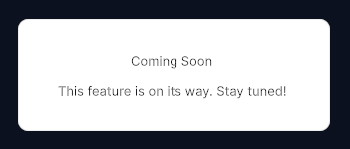

---------

## Contents

> 1 [Overview](#overview)
>
> 2 [Properties](#properties)
>
> 3 [USS Classes](#uss-classes)
>
> 4 [Events](#events)
>
> 5 [Methods](#methods)
>
> 6 [Usage](#usage)
>
> 7 [Using the Control](#using-the-control)
>
> 8 [Example Scenes](#example-scenes)
>
> 9 [Credits and Donation](#credits-and-donation)
>
> 10 [External links](#external-links)

---------

## Overview

`ComingSoonMessage` is a simple full-area placeholder element that fills its container and communicates that a feature or screen is not yet available. It renders a background layer, a prominent title, and a descriptive message label.

Typical use cases:

- Placeholder screens during development or staged rollouts
- Stub pages inside a `ScrollSnap` onboarding flow
- In-progress feature sections within a settings or navigation layout

---------

## Properties

| Name | Description | Options |
| --- | --- | --- |
| `Title` | Gets or sets the large heading text. | `string` |

---------

## USS Classes

| Class | Description |
| --- | --- |
| `comingSoonMessage` | Root element. Fills its parent and centers its contents. |
| `comingSoonMessage__background` | Decorative background layer (may carry color or texture). |
| `comingSoonMessage__title` | Large heading label. |
| `comingSoonMessage__label` | Secondary descriptive message label below the title. |

---------

## Events

This control does not emit events.

---------

## Methods

| Signature | Description |
| --- | --- |
| `SetMessage(string text)` | Sets the secondary descriptive message shown below the title. |

---------

## Usage

> Add the control to your scene using:
>
> GameObject -> UI Toolkit -> Extensions -> Coming Soon Message
>
> This creates a UIDocument in the scene (plus a PanelSettings with the default runtime theme, if the project has none) and assigns an editable starter template with demo content, copied to *Assets/UI Toolkit Extensions*.
>
> A starter template can also be added to an existing document using:
>
> Assets -> Create -> UI Toolkit -> Extensions -> Coming Soon Message Starter

Alternatively, drag the control into a document from the UI Builder Library (*Project -> Custom Controls -> UnityUIToolkit.Extensions*) or declare it directly in UXML:

```xml
<ui:UXML xmlns:ui="UnityEngine.UIElements" xmlns:ext="UnityUIToolkit.Extensions" editor-extension-mode="False">
    <ext:ComingSoonMessage title="Coming Soon" message="This feature is on its way. Stay tuned!" />
</ui:UXML>
```

The shared extensions stylesheet is applied automatically when the control is created in the Editor and in Play Mode, so no manual stylesheet reference is needed while authoring. The starter templates also reference the stylesheet explicitly, which covers player builds; for hand-written UXML or code-first UI in builds, add the stylesheet to your UXML or panel theme.

---------

## Using the Control

### Stub Page in a ScrollSnap

```csharp
using UnityEngine;
using UnityEngine.UIElements;
using UnityUIToolkit.Extensions;

public class OnboardingController : MonoBehaviour
{
    [SerializeField] private UIDocument _document;

    private void OnEnable()
    {
        var root = _document.rootVisualElement;
        var scrollSnap = root.Q<ScrollSnap>("onboardingSnap");

        // Page 1 — real content
        var welcomePage = new VisualElement();
        welcomePage.AddToClassList("sample-page");
        welcomePage.AddToClassList("sample-page--blue");
        scrollSnap.Add(welcomePage);

        // Page 2 — placeholder
        var placeholder = new ComingSoonMessage();
        placeholder.Title = "Social Features";
        placeholder.SetMessage("Connect with friends and share your progress. Launching soon.");
        scrollSnap.Add(placeholder);

        // Page 3 — another placeholder
        var placeholder2 = new ComingSoonMessage();
        placeholder2.Title = "Challenges";
        placeholder2.SetMessage("Weekly challenges and leaderboards are on their way.");
        scrollSnap.Add(placeholder2);
    }
}
```

### Dynamic Title Update

```csharp
// Swap placeholder text based on user role
if (user.IsPremium)
{
    _comingSoon.Title = "Advanced Analytics";
    _comingSoon.SetMessage("Your detailed stats dashboard is being prepared.");
}
else
{
    _comingSoon.Title = "Premium Feature";
    _comingSoon.SetMessage("Upgrade to unlock this section.");
}
```

---------

## Example Scenes

This control is demonstrated in the following package example:

- [Scroll Snap & Dots](/uitoolkit/examples/scroll-snap-and-dots/)

---------

## Credits and Donation

SimonDarksideJ

---------

## External links

[UI Toolkit Extensions repository](https://github.com/Unity-UI-Extensions/com.unity.uitoolkitextensions) | [OpenUPM package](https://openupm.com/packages/com.unity.uitoolkitextensions/)

---------
