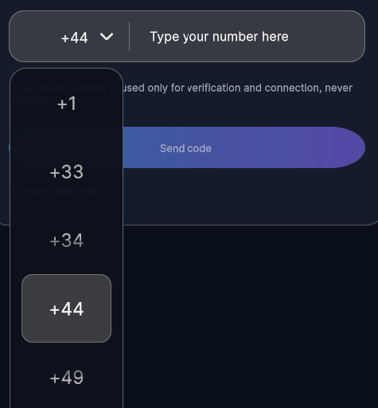

---------

## Contents

> 1 [Overview](#overview)
>
> 2 [Properties](#properties)
>
> 3 [USS Classes](#uss-classes)
>
> 4 [Events](#events)
>
> 5 [Methods](#methods)
>
> 6 [Usage](#usage)
>
> 7 [Using the Control](#using-the-control)
>
> 8 [Video Demo](#video-demo)
>
> 9 [Credits and Donation](#credits-and-donation)
>
> 10 [External links](#external-links)

---------

## Overview

`DropDownControl` is a wheel-style dropdown picker that opens from an inline trigger and lets the user confirm a single value from a vertically scrollable modal list.

Typical use cases:

- Dial-code or country-code selection before a phone field
- Compact selectors that need a touch-friendly modal confirmation step
- Any workflow where a finite string list should feel like a native mobile picker rather than a standard menu

---------

## Properties

| Property | Type | Description |
| --- | --- | --- |
| `Items` | `IReadOnlyList<string>` | Ordered values shown in the picker. Updating the list refreshes the trigger label and open list content. |
| `Value` | `string` | The currently selected value, or an empty string when `Items` is empty. |

---------

## USS Classes

| Class | Description |
| --- | --- |
| `dropDownControl` | Root element for the control. |
| `dropDownControl__trigger` | Closed-state trigger element. |
| `dropDownControl__triggerLabel` | Label showing the current selection. |
| `dropDownControl__triggerIcon` | Chevron icon inside the trigger. |
| `dropDownControl__backdrop` | Full-screen backdrop injected while the picker is open. |
| `dropDownControl__panel` | Floating modal panel that contains the picker list. |
| `dropDownControl__viewport` | Clipped viewport used to display the visible rows. |
| `dropDownControl__list` | Scrolling row container translated by the control logic. |
| `dropDownControl__row` | A single rendered picker row. |
| `dropDownControl__selectionLane` | Highlight lane showing the centred selection. |
| `dropDownControl__fadeTop` | Top fade overlay used to de-emphasize off-centre rows. |
| `dropDownControl__fadeBottom` | Bottom fade overlay used to de-emphasize off-centre rows. |
| `dropDownControl--open` | Root modifier applied while the modal picker is visible. |

---------

## Events

| Name | Description | Arguments |
| --- | --- | --- |
| `ValueChanged` | Fired after the user confirms a new selection. | `string selectedValue` |
| `OpenStateChanged` | Fired when the modal picker is opened or closed. | `bool isOpen` |

---------

## Methods

| Signature | Description |
| --- | --- |
| `SetDefault(string value)` | Sets the selected item when the supplied value exists in `Items`. |

---------

## Usage

> Add the control to your scene using:
>
> GameObject -> UI Toolkit -> Extensions -> Drop Down Control
>
> This creates a UIDocument in the scene (plus a PanelSettings with the default runtime theme, if the project has none) and assigns an editable starter template with demo content, copied to *Assets/UI Toolkit Extensions*.
>
> A starter template can also be added to an existing document using:
>
> Assets -> Create -> UI Toolkit -> Extensions -> Drop Down Control Starter

Alternatively, drag the control into a document from the UI Builder Library (*Project -> Custom Controls -> UnityUIToolkit.Extensions*) or declare it directly in UXML:

```xml
<ui:UXML xmlns:ui="UnityEngine.UIElements" xmlns:ext="UnityUIToolkit.Extensions" editor-extension-mode="False">
    <ext:DropDownControl items="Option One,Option Two,Option Three,Option Four,Option Five" />
</ui:UXML>
```

The shared extensions stylesheet is applied automatically when the control is created in the Editor and in Play Mode, so no manual stylesheet reference is needed while authoring. The starter templates also reference the stylesheet explicitly, which covers player builds; for hand-written UXML or code-first UI in builds, add the stylesheet to your UXML or panel theme.

---------

## Using the Control

```csharp
using UnityEngine;
using UnityEngine.UIElements;
using UnityUIToolkit.Extensions;

public class DialCodePickerExample : MonoBehaviour
{
    [SerializeField] private UIDocument document;

    private void OnEnable()
    {
        var root = document.rootVisualElement;

        var picker = new DropDownControl
        {
            Items = new[] { "+1", "+33", "+44", "+49" },
        };

        picker.SetDefault("+44");
        picker.ValueChanged += selected => Debug.Log($"Selected {selected}");

        root.Add(picker);
    }
}
```

---------

## Video Demo

<video class="demo-video" autoplay loop muted playsinline poster="dropdown-example.png" aria-label="Dropdown demo">
  <source src="dropdown-demo.webm" type="video/webm">
</video>

### Example Scenes

This control is demonstrated in the following package example:

- [Dropdown Phone Entry](/uitoolkit/examples/dropdown-phone-entry/)

---------

## Credits and Donation

SimonDarksideJ

---------

## External links

[UI Toolkit Extensions repository](https://github.com/Unity-UI-Extensions/com.unity.uitoolkitextensions) | [OpenUPM package](https://openupm.com/packages/com.unity.uitoolkitextensions/)

---------
