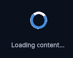

---------

## Contents

> 1 [Overview](#overview)
>
> 2 [Properties](#properties)
>
> 3 [USS Classes](#uss-classes)
>
> 4 [Events](#events)
>
> 5 [Methods](#methods)
>
> 6 [Usage](#usage)
>
> 7 [Using the Control](#using-the-control)
>
> 8 [Video Demo](#video-demo)
>
> 9 [Credits and Donation](#credits-and-donation)
>
> 10 [External links](#external-links)

---------

## Overview

`LoadingIcon` is a continuously rotating image element used to indicate background work. Rotation is driven by a scheduled callback that fires every 16 ms. An optional `blockInteraction` flag captures pointer events so the user cannot interact with elements beneath the spinner while it is active.

Typical use cases:

- Async operation feedback (API calls, data loading)
- Image upload or file transfer progress indicator
- Form submission spinner overlay

---------

## Properties

This control is configured through method calls. The visibility and animation state are reflected in modifier classes.

---------

## USS Classes

| Class | Description |
| --- | --- |
| `loadingIcon` | Root element. |
| `loadingIcon__image` | The rotating image. Fixed at 40 × 40 px. |
| `loadingIcon--animating` | Modifier applied while rotation is active. |
| `loadingIcon--visible` | Modifier applied while the icon is shown. Pair with USS to control opacity or display. |

---------

## Events

This control does not emit events.

---------

## Methods

| Signature | Description |
| --- | --- |
| `SetIcon(Texture2D texture)` | Sets the texture used for the spinning image. |
| `PlayLoading(float customSpeed = 1f, bool blockInteraction = false)` | Starts the rotation animation. `customSpeed` is the duration of one full 360° rotation in seconds; lower values spin faster. When `blockInteraction` is `true` the control captures all pointer events. |
| `StopLoading()` | Stops the rotation, releases pointer capture, and removes the `--animating` and `--visible` modifiers. |

---------

## Usage

> Add the control to your scene using:
>
> GameObject -> UI Toolkit -> Extensions -> Loading Icon
>
> This creates a UIDocument in the scene (plus a PanelSettings with the default runtime theme, if the project has none) and assigns an editable starter template with demo content, copied to *Assets/UI Toolkit Extensions*.
>
> A starter template can also be added to an existing document using:
>
> Assets -> Create -> UI Toolkit -> Extensions -> Loading Icon Starter

Alternatively, drag the control into a document from the UI Builder Library (*Project -> Custom Controls -> UnityUIToolkit.Extensions*) or declare it directly in UXML:

```xml
<ui:UXML xmlns:ui="UnityEngine.UIElements" xmlns:ext="UnityUIToolkit.Extensions" editor-extension-mode="False">
    <ext:LoadingIcon name="loading-icon" />
</ui:UXML>
```

The shared extensions stylesheet is applied automatically when the control is created in the Editor and in Play Mode, so no manual stylesheet reference is needed while authoring. The starter templates also reference the stylesheet explicitly, which covers player builds; for hand-written UXML or code-first UI in builds, add the stylesheet to your UXML or panel theme.

---------

## Using the Control

### Simple Loading Overlay

```csharp
using System.Threading.Tasks;
using UnityEngine;
using UnityEngine.UIElements;
using UnityUIToolkit.Extensions;

public class UploadController : MonoBehaviour
{
    [SerializeField] private UIDocument _document;
    [SerializeField] private Texture2D _spinnerTexture;

    private LoadingIcon _spinner;

    private void OnEnable()
    {
        var root = _document.rootVisualElement;

        _spinner = new LoadingIcon();
        _spinner.SetIcon(_spinnerTexture);

        root.Q<VisualElement>("overlayContainer").Add(_spinner);

        root.Q<Button>("uploadButton").clicked += () => _ = StartUpload();
    }

    private async Task StartUpload()
    {
        // 0.8s per rotation, block taps on underlying UI
        _spinner.PlayLoading(customSpeed: 0.8f, blockInteraction: true);

        try
        {
            await UploadFileAsync();
        }
        finally
        {
            _spinner.StopLoading();
        }
    }

    private async Task UploadFileAsync()
    {
        // Simulate async upload
        await Task.Delay(2000);
    }
}
```

### Speed Variants

```csharp
// Slow, calm indicator — 1.5 seconds per revolution
_spinner.PlayLoading(customSpeed: 1.5f);

// Fast, urgent indicator — 0.4 seconds per revolution
_spinner.PlayLoading(customSpeed: 0.4f);
```

---------

## Video Demo

<video class="demo-video" autoplay loop muted playsinline poster="loading-icon-example.png" aria-label="Loading Icon demo">
  <source src="loading-icon-demo.webm" type="video/webm">
</video>

### Example Scenes

This control is demonstrated in the following package example:

- [Content Explorer](/uitoolkit/examples/content-explorer/)

---------

## Credits and Donation

SimonDarksideJ

---------

## External links

[UI Toolkit Extensions repository](https://github.com/Unity-UI-Extensions/com.unity.uitoolkitextensions) | [OpenUPM package](https://openupm.com/packages/com.unity.uitoolkitextensions/)

---------
