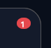

---------

## Contents

> 1 [Overview](#overview)
>
> 2 [Properties](#properties)
>
> 3 [USS Classes](#uss-classes)
>
> 4 [Methods](#methods)
>
> 5 [Usage](#usage)
>
> 6 [Using the Control](#using-the-control)
>
> 7 [Example Scenes](#example-scenes)
>
> 8 [Credits and Donation](#credits-and-donation)
>
> 9 [External links](#external-links)

---------

## Overview

`NotificationBadge` is a small, rounded unread-count badge — the kind that sits over an icon or avatar to show a number of pending items. It renders a single count `Label` inside a pill/dot root. The badge manages its own visibility: when the count is zero or less it hides itself (`display: none`), and when the count reaches 100 or more the label clamps to `"99+"` so the badge never grows unbounded.

The control owns only the count. It carries no positioning logic of its own — overlay it on a host element (icon, tab, avatar) with USS (`position: absolute` plus `top`/`right`) in your own stylesheet.

Typical use cases:

- Unread message / notification counts over an inbox or bell icon
- Cart item counts on a shop button
- Pending-item badges on tab bar or avatar elements

---------

## Properties

| Name | Description | Options |
| --- | --- | --- |
| `Count` | Gets or sets the displayed count. Setting it updates visibility and the label text. Bindable in UXML via the `count` attribute. | `int` |

---------

## USS Classes

| Class | Description |
| --- | --- |
| `notificationBadge` | Root element. Style its background, size, and `border-radius` here, and position it over its host (e.g. `position: absolute`). |
| `notificationBadge__count` | The count `Label` centered within the badge. Picking is ignored so taps pass through to the host. |

---------

## Methods

| Signature | Description |
| --- | --- |
| `SetCount(int value)` | Sets the count, then shows the badge (`Count > 0`) or hides it (`Count <= 0`). Displays `"99+"` for any value of 100 or more. Equivalent to assigning `Count`. |

---------

## Usage

> Add the control to your scene using:
>
> GameObject -> UI Toolkit -> Extensions -> Notification Badge
>
> This creates a UIDocument in the scene (plus a PanelSettings with the default runtime theme, if the project has none) and assigns an editable starter template with demo content, copied to *Assets/UI Toolkit Extensions*.
>
> A starter template can also be added to an existing document using:
>
> Assets -> Create -> UI Toolkit -> Extensions -> Notification Badge Starter

Alternatively, drag the control into a document from the UI Builder Library (*Project -> Custom Controls -> UnityUIToolkit.Extensions*) or declare it directly in UXML:

```xml
<ui:UXML xmlns:ui="UnityEngine.UIElements" xmlns:ext="UnityUIToolkit.Extensions" editor-extension-mode="False">
    <ext:NotificationBadge count="3" />
</ui:UXML>
```

The shared extensions stylesheet is applied automatically when the control is created in the Editor and in Play Mode, so no manual stylesheet reference is needed while authoring. The starter templates also reference the stylesheet explicitly, which covers player builds; for hand-written UXML or code-first UI in builds, add the stylesheet to your UXML or panel theme.

---------

## Using the Control

### Overlay a badge on an icon button

```csharp
using UnityEngine;
using UnityEngine.UIElements;
using UnityUIToolkit.Extensions;

public class InboxButtonController : MonoBehaviour
{
    [SerializeField] private UIDocument _document;

    private NotificationBadge _badge;

    private void OnEnable()
    {
        var inboxButton = _document.rootVisualElement.Q<VisualElement>("inbox-button");

        _badge = new NotificationBadge();
        inboxButton.Add(_badge);   // position via USS on .notificationBadge

        _badge.Count = 3;          // badge appears showing "3"
    }

    public void MarkAllRead()
    {
        _badge.Count = 0;          // badge hides itself
    }
}
```

### In UXML

```xml
<ui:UXML xmlns:ui="UnityEngine.UIElements" xmlns:ext="UnityUIToolkit.Extensions" editor-extension-mode="False">
    <ui:VisualElement name="inbox-button" class="icon-button">
        <ext:NotificationBadge count="5" />
    </ui:VisualElement>
</ui:UXML>
```

The badge clamps automatically: `_badge.Count = 250;` displays `"99+"`.

---------

## Example Scenes

This control is demonstrated in the following package example:

- [Notification List](/uitoolkit/examples/notification-list/)

---------

## Credits and Donation

SimonDarksideJ

---------

## External links

[UI Toolkit Extensions repository](https://github.com/Unity-UI-Extensions/com.unity.uitoolkitextensions) | [OpenUPM package](https://openupm.com/packages/com.unity.uitoolkitextensions/)

---------
