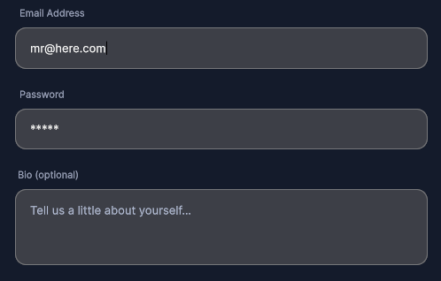

---------

## Contents

> 1 [Overview](#overview)
>
> 2 [Properties](#properties)
>
> 3 [USS Classes](#uss-classes)
>
> 4 [Events](#events)
>
> 5 [Methods](#methods)
>
> 6 [Usage](#usage)
>
> 7 [Using the Control](#using-the-control)
>
> 8 [Example Scenes](#example-scenes)
>
> 9 [Credits and Donation](#credits-and-donation)
>
> 10 [External links](#external-links)

---------

## Overview

`PillInputField` is a styled text input with a floating label and pill-shaped container. It handles mobile focus correctly by tracking pointer movement to distinguish taps from drags (8 px slop threshold) before opening the on-screen keyboard. Validation fires automatically on blur via `OnValidation`. The label is hidden when empty.

Typical use cases:

- Login and signup forms
- Profile editing screens
- Any form that needs a labeled, styled input compatible with mobile keyboards

---------

## Properties

| Name | Description | Options |
| --- | --- | --- |
| `Label` | Gets or sets the label text shown above (or inside when empty) the input. | `string` |
| `Value` | Gets or sets the current input text. Setting this fires `OnValueChanged`. | `string` |
| `KeyboardType` | Gets or sets the touch keyboard type for mobile platforms. | `TouchScreenKeyboardType` |

---------

## USS Classes

| Class | Description |
| --- | --- |
| `pillInputField` | Root element. |
| `pillInputField__label` | Floating label element. Hidden automatically when `Label` is empty. |
| `pillInputField__input` | The inner `TextField` element. |
| `pillInputField__inputTextContent` | Internal text content element used for style overrides. |
| `pillInputField--passwordMode` | Modifier applied when password mode is active. |
| `pillInputField--multiline` | Modifier applied when multiline mode is active. |

---------

## Events

| Name | Description | Arguments |
| --- | --- | --- |
| `OnValueChanged` | Fired whenever the input value changes. | `string newValue` |
| `OnValidation` | Fired when the field loses focus (blur). Use this to show inline validation errors. | `string currentValue` |

---------

## Methods

| Signature | Description |
| --- | --- |
| `Focus()` | Programmatically focuses the input field. |
| `Blur()` | Programmatically removes focus from the input field. |
| `SetPlaceholder(string text)` | Sets the placeholder hint text shown when the field is empty and unfocused. |
| `SetPasswordMode(bool enabled)` | Enables or disables password masking. Applies or removes the `--passwordMode` modifier. |
| `SetMaxLength(int length)` | Sets the maximum number of characters allowed. |
| `SetMultiline(bool enabled)` | Enables or disables multiline input. Applies or removes the `--multiline` modifier. |
| `SetBackgroundColor(Color color)` | Sets the background color of the pill container. |
| `SetTextColor(Color color)` | Sets the text color of the input. |
| `SetFontSize(float size)` | Sets the font size of the input text. |
| `Validate()` | Manually triggers `OnValidation` with the current value. |

---------

## Usage

> Add the control to your scene using:
>
> GameObject -> UI Toolkit -> Extensions -> Pill Input Field
>
> This creates a UIDocument in the scene (plus a PanelSettings with the default runtime theme, if the project has none) and assigns an editable starter template with demo content, copied to *Assets/UI Toolkit Extensions*.
>
> A starter template can also be added to an existing document using:
>
> Assets -> Create -> UI Toolkit -> Extensions -> Pill Input Field Starter

Alternatively, drag the control into a document from the UI Builder Library (*Project -> Custom Controls -> UnityUIToolkit.Extensions*) or declare it directly in UXML:

```xml
<ui:UXML xmlns:ui="UnityEngine.UIElements" xmlns:ext="UnityUIToolkit.Extensions" editor-extension-mode="False">
    <ext:PillInputField label="Email Address" placeholder="you@example.com" keyboard-type="EmailAddress" />
</ui:UXML>
```

The shared extensions stylesheet is applied automatically when the control is created in the Editor and in Play Mode, so no manual stylesheet reference is needed while authoring. The starter templates also reference the stylesheet explicitly, which covers player builds; for hand-written UXML or code-first UI in builds, add the stylesheet to your UXML or panel theme.

---------

## Using the Control

### Login Form

```csharp
using UnityEngine;
using UnityEngine.UIElements;
using UnityUIToolkit.Extensions;

public class LoginController : MonoBehaviour
{
    [SerializeField] private UIDocument _document;

    private PillInputField _emailField;
    private PillInputField _passwordField;
    private string _emailError;

    private void OnEnable()
    {
        var root = _document.rootVisualElement;
        var form = root.Q<VisualElement>("loginForm");

        _emailField = new PillInputField();
        _emailField.Label = "Email";
        _emailField.SetPlaceholder("your@email.com");
        _emailField.KeyboardType = TouchScreenKeyboardType.EmailAddress;
        _emailField.OnValueChanged += _ => _emailError = null;
        _emailField.OnValidation += value =>
        {
            if (!value.Contains("@"))
                _emailError = "Enter a valid email address";
        };

        _passwordField = new PillInputField();
        _passwordField.Label = "Password";
        _passwordField.SetPlaceholder("••••••••");
        _passwordField.SetPasswordMode(true);
        _passwordField.SetMaxLength(64);

        form.Add(_emailField);
        form.Add(_passwordField);

        root.Q<Button>("loginButton").clicked += OnLoginTapped;
    }

    private void OnLoginTapped()
    {
        _emailField.Validate();
        _passwordField.Validate();

        if (_emailError != null)
        {
            Debug.Log(_emailError);
            return;
        }

        Debug.Log($"Login: {_emailField.Value}");
    }
}
```

---------

## Example Scenes

This control is demonstrated in the following package examples:

- [Registration Form](/uitoolkit/examples/registration-form/)
- [Dropdown Phone Entry](/uitoolkit/examples/dropdown-phone-entry/)
- [Content Explorer](/uitoolkit/examples/content-explorer/)

---------

## Credits and Donation

SimonDarksideJ

---------

## External links

[UI Toolkit Extensions repository](https://github.com/Unity-UI-Extensions/com.unity.uitoolkitextensions) | [OpenUPM package](https://openupm.com/packages/com.unity.uitoolkitextensions/)

---------
