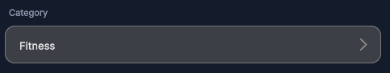

---------

## Contents

> 1 [Overview](#overview)
>
> 2 [Properties](#properties)
>
> 3 [USS Classes](#uss-classes)
>
> 4 [Events](#events)
>
> 5 [Methods](#methods)
>
> 6 [Usage](#usage)
>
> 7 [Using the Control](#using-the-control)
>
> 8 [Example Scenes](#example-scenes)
>
> 9 [Credits and Donation](#credits-and-donation)
>
> 10 [External links](#external-links)

---------

## Overview

`PillSelector` is a read-only pill-shaped field with a chevron icon that fires a `Clicked` event when tapped. It does not manage a picker internally; the consumer is responsible for displaying the selection UI and writing the chosen value back to the `Value` property.

Typical use cases:

- Inline date or time picker trigger row
- Option selector row that opens a modal or bottom sheet
- Any read-only labeled field that indicates a "tap to change" interaction

---------

## Properties

| Name | Description | Options |
| --- | --- | --- |
| `Label` | Gets or sets the descriptive label shown above the selector value. | `string` |
| `Value` | Gets or sets the currently displayed selected value text. | `string` |

---------

## USS Classes

| Class | Description |
| --- | --- |
| `pillSelector` | Root element. |
| `pillSelector__label` | Label element shown above the value. |
| `pillSelector__container` | Pill-shaped row containing the value label and chevron. |
| `pillSelector__clickableLabel` | The text element inside the container that displays `Value`. |
| `pillSelector__icon` | Chevron icon element. Fixed at 16 × 16 px. |

---------

## Events

| Name | Description | Arguments |
| --- | --- | --- |
| `Clicked` | Fired when the user taps the selector row. The consumer should open a picker and update `Value` with the result. | none |

---------

## Methods

| Signature | Description |
| --- | --- |
| `SetFontSize(float size)` | Sets the font size for the value label. |

---------

## Usage

> Add the control to your scene using:
>
> GameObject -> UI Toolkit -> Extensions -> Pill Selector
>
> This creates a UIDocument in the scene (plus a PanelSettings with the default runtime theme, if the project has none) and assigns an editable starter template with demo content, copied to *Assets/UI Toolkit Extensions*.
>
> A starter template can also be added to an existing document using:
>
> Assets -> Create -> UI Toolkit -> Extensions -> Pill Selector Starter

Alternatively, drag the control into a document from the UI Builder Library (*Project -> Custom Controls -> UnityUIToolkit.Extensions*) or declare it directly in UXML:

```xml
<ui:UXML xmlns:ui="UnityEngine.UIElements" xmlns:ext="UnityUIToolkit.Extensions" editor-extension-mode="False">
    <ext:PillSelector label="Category" value="Select an option" />
</ui:UXML>
```

The shared extensions stylesheet is applied automatically when the control is created in the Editor and in Play Mode, so no manual stylesheet reference is needed while authoring. The starter templates also reference the stylesheet explicitly, which covers player builds; for hand-written UXML or code-first UI in builds, add the stylesheet to your UXML or panel theme.

---------

## Using the Control

### Date Picker Trigger

```csharp
using System;
using UnityEngine;
using UnityEngine.UIElements;
using UnityUIToolkit.Extensions;

public class EventFormController : MonoBehaviour
{
    [SerializeField] private UIDocument _document;

    private PillSelector _dateSelector;
    private DateTime _selectedDate = DateTime.Today;

    private void OnEnable()
    {
        var root = _document.rootVisualElement;

        _dateSelector = new PillSelector();
        _dateSelector.Label = "Event Date";
        _dateSelector.Value = _selectedDate.ToString("MMMM d, yyyy");

        _dateSelector.Clicked += OnDateSelectorTapped;

        root.Q<VisualElement>("eventForm").Add(_dateSelector);
    }

    private void OnDateSelectorTapped()
    {
        // Open your date picker UI here.
        // When the user confirms a date, call ApplyDate().
        Debug.Log("Open date picker");
        ApplyDate(DateTime.Today.AddDays(7)); // example result
    }

    private void ApplyDate(DateTime date)
    {
        _selectedDate = date;
        _dateSelector.Value = date.ToString("MMMM d, yyyy");
    }
}
```

### Country Selector Row

```csharp
_countrySelector = new PillSelector();
_countrySelector.Label = "Country";
_countrySelector.Value = "Select country";
_countrySelector.SetFontSize(15f);

_countrySelector.Clicked += () =>
{
    // Show modal country list
    // On confirmation: _countrySelector.Value = chosenCountry;
};
```

---------

## Example Scenes

This control is demonstrated in the following package example:

- [Registration Form](/uitoolkit/examples/registration-form/)

---------

## Credits and Donation

SimonDarksideJ

---------

## External links

[UI Toolkit Extensions repository](https://github.com/Unity-UI-Extensions/com.unity.uitoolkitextensions) | [OpenUPM package](https://openupm.com/packages/com.unity.uitoolkitextensions/)

---------
